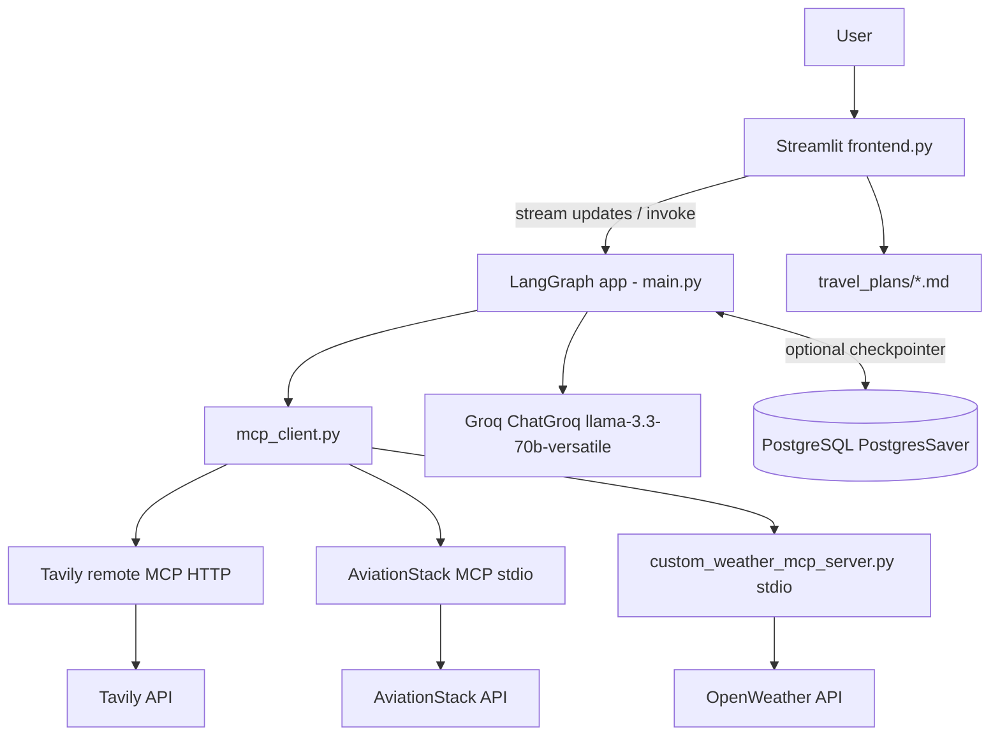
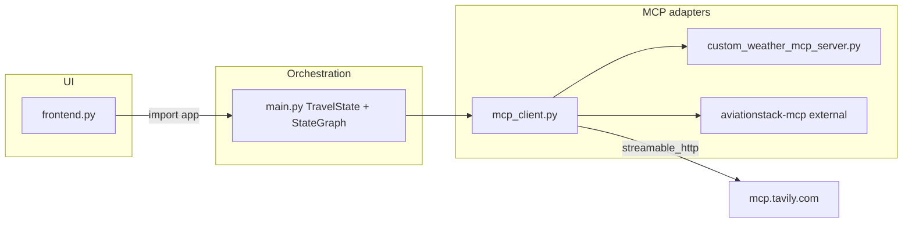
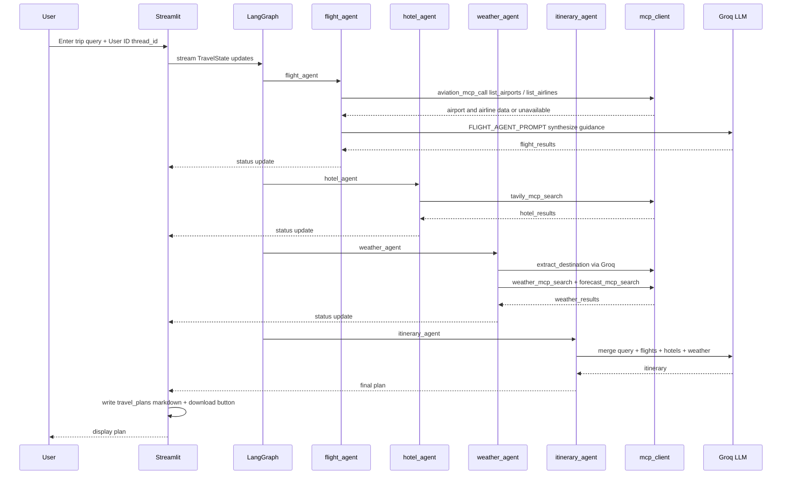
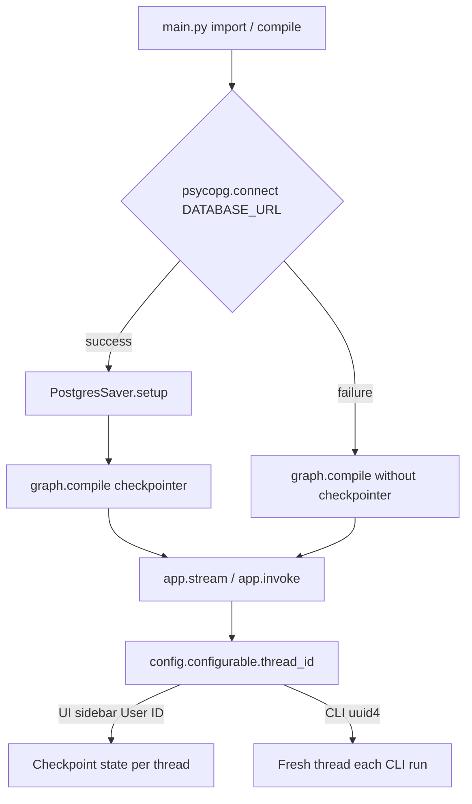

# Travel MCP — Multi-Agent Travel Planner

## 1. Snapshot
- **One-liner:** A Streamlit + LangGraph app that turns a natural-language trip request into a researched itinerary using specialized agents and MCP-backed tools.
- **Who it is for:** Travelers (especially budget-conscious planners) who want a single prompt to assemble flights guidance, hotels, weather, and a day-by-day plan.
- **What success looks like:** User enters a trip brief → four agents run in sequence → live UI shows each step → a downloadable markdown travel plan is saved under `travel_plans/`.

## 2. Problem

### Pain
Planning a trip from a vague brief (“7-day Japan under ₹2L with flights, hotels, sightseeing”) usually means bouncing between flight sites, hotel search, weather apps, and blog itineraries. A single LLM chat can invent flights, miss live hotel options, or ignore weather—because it has no grounded tool access.

Tool-using agents help, but one monolithic agent with many tools tends to skip steps, mix concerns, or call the wrong API. Travel planning naturally splits into flight context, stay research, weather, and itinerary synthesis—each needing different data sources and prompts.

Without shared state and optional memory, each run is disposable: you cannot resume a session or keep a stable thread for a given user. Without a thin UI, the pipeline only works in a terminal.

### Who suffered
- **Budget / DIY travelers** drafting multi-day international trips from India-style budget constraints and natural-language prompts
- **Context:** Need flights + hotels + weather + itinerary in one pass, without manually stitching four research tabs

### Constraints
- Multiple paid/external APIs (Groq, Tavily, AviationStack, OpenWeather) required at runtime; keys only in local `.env`
- AviationStack MCP is an external clone (`aviationstack-mcp/`), gitignored, with its own `uv` venv—deployment must provision it or degrade gracefully
- PostgreSQL used for LangGraph checkpoints; app must still run if DB is down
- Windows-first local paths for MCP stdio (`Scripts/python.exe`); Linux/Codespaces need alternate binary path
- Sequential graph (not parallel agents)—simpler state, higher end-to-end latency
- No auth product layer; “User ID” is only a LangGraph `thread_id`
- Repo folder name references CrewAI; implementation is LangGraph only (no CrewAI in dependencies)

### Problem statement (1 sentence)
Build a grounded multi-agent travel planner that researches flights, hotels, and weather via MCP tools, then synthesizes a usable itinerary from one natural-language request—with a Streamlit UI and optional Postgres session memory.

## 3. Solution

### Approach
The system is a **sequential LangGraph `StateGraph`** over a shared `TravelState` (`user_query`, `flight_results`, `hotel_results`, `weather_results`, `itinerary`, `messages`, `llm_calls`). Nodes: `flight_agent` → `hotel_agent` → `weather_agent` → `itinerary_agent`.

External capabilities are isolated behind **MCP** in `mcp_client.py`:
- **Tavily** — remote MCP over streamable HTTP (`tavily_search`) for hotel research
- **AviationStack** — local stdio MCP (if venv exists) for `list_airports` / `list_airlines`; flight agent then uses Groq to write route guidance from that reference data plus the user query
- **Weather** — custom local FastMCP server (`custom_weather_mcp_server.py`) calling OpenWeather current + 5-slot forecast; city is extracted from the query with a small Groq call (`extract_destination`)

`frontend.py` streams `app.stream(..., stream_mode="updates")` so each agent’s output appears live. Plans are auto-written as markdown and offered for download. `main.py` also supports a CLI `invoke` path. Postgres `PostgresSaver` is wired when `DATABASE_URL` connects; otherwise the graph compiles without a checkpointer.

### Core features shipped
- **Natural-language trip intake (Streamlit):** one textarea + quick prompts → full pipeline; matters because the product surface matches how people actually describe trips
- **Flight agent + AviationStack MCP:** loads airport/airline reference via MCP, then Groq generates structured flight guidance (airports, airlines, duration, fare range, booking tips); matters for grounded aviation context without a full booking API
- **Hotel agent + Tavily MCP:** live web search for stays matching the trip brief; matters for current hotel/budget signal instead of static LLM memory
- **Weather agent + custom OpenWeather MCP:** current weather + short forecast for the extracted destination; matters so itineraries can account for conditions
- **Itinerary agent:** merges flight, hotel, and weather state into a day-by-day plan via Groq (`llama-3.3-70b-versatile`); matters as the user-facing deliverable
- **Live agent pipeline UI:** Streamlit `st.status` per node as the graph streams; matters for transparency and debugging of multi-step runs
- **Markdown save + download:** writes `travel_plans/travel_plan_*.md`; matters for keeping and sharing the output
- **Optional Postgres checkpointing:** `thread_id` from sidebar User ID when DB is up; matters for session continuity without blocking local demos when Postgres is unavailable
- **Graceful Aviation MCP fallback:** if aviation venv/binary is missing, flight path returns an explicit unavailable message and the rest of the graph can continue

## 4. Architecture

### System context



### Module map



### LangGraph node topology (as compiled)


## 5. Key flows

### End-to-end request flow



### MCP tool wiring

```mermaid
flowchart TB
    subgraph FlightPath [Flight path]
        FA[flight_agent]
        AC[aviation_client MultiServerMCPClient stdio]
        FA -->|asyncio.run aviation_mcp_call| AC
        AC -->|list_airports list_airlines| AS[aviationstack_mcp]
    end

    subgraph HotelPath [Hotel path]
        HA[hotel_agent]
        TC[tavily_client MultiServerMCPClient HTTP]
        HA -->|asyncio.run tavily_mcp_search| TC
        TC -->|tavily_search| TV[Tavily MCP]
    end

    subgraph WeatherPath [Weather path]
        WA[weather_agent]
        EX[extract_destination Groq]
        WC[weather_client MultiServerMCPClient stdio]
        WA --> EX
        WA -->|weather_mcp_search forecast_mcp_search| WC
        WC --> WS[FastMCP Weather Server]
        WS -->|get_current_weather get_forecast| OW[OpenWeather REST]
    end
```



### Checkpoint / memory path



## 6. Challenges & decisions

| Challenge | What the code reveals | Decision / tradeoff |
|---|---|---|
| Multi-source tooling without one mega-prompt | Separate agents + MCP transports (HTTP + stdio) | Clear ownership per step; more latency and process overhead |
| Aviation dependency heavy for demos | `aviation_client` only if local `.venv` python exists | Soft-fail message; itinerary can still be produced from other agents + LLM |
| Persistent memory vs portable demo | `PostgresSaver` behind try/except at compile time | App boots without Postgres; memory is best-effort |
| Nested async inside sync graph nodes | Agents call `asyncio.run(...)` on MCP helpers | Works in simple Streamlit/CLI runs; fragile if an event loop is already running |
| Flight “search” vs reference synthesis | Uses `list_airports` / `list_airlines` then LLM; truncates payloads to 3000 chars | Guidance, not live ticket inventory or priced OD search |
| Destination parsing for weather | Extra Groq call `extract_destination` | Simple NLP extraction; wrong city → wrong weather |
| Hotel MCP payload shape | Raw tool result (often JSON-in-text) shown in UI | Functional but noisy UX; itinerary LLM must interpret cluttered search blobs |
| Platform paths | Windows `Scripts/python.exe` vs Unix `bin/python` for Aviation MCP | Explicit `sys.platform` branch in `mcp_client.py` |
| Naming vs stack | Folder `Travel_CrewAI_LangGraph`; deps are LangGraph/LangChain | Documented as LangGraph; CrewAI not used |

## 7. Tech stack

| Layer | Choice | Evidence |
|---|---|---|
| UI | Streamlit | `frontend.py`, port `8501` |
| Orchestration | LangGraph `StateGraph` | `main.py` |
| LLM | Groq `llama-3.3-70b-versatile` | `ChatGroq` in `main.py` / `mcp_client.py` |
| Tool protocol | MCP (`langchain-mcp-adapters`, `mcp`) | `mcp_client.py`, weather FastMCP server |
| Hotel search | Tavily remote MCP | `tavily_search` over `mcp.tavily.com` |
| Flights reference | AviationStack MCP (external repo) | `aviationstack-mcp`, stdio |
| Weather | Custom FastMCP + OpenWeather REST | `custom_weather_mcp_server.py` |
| Memory | PostgreSQL + `langgraph-checkpoint-postgres` | optional `PostgresSaver` |
| Config | `python-dotenv` | `.env` keys: Groq, Tavily, AviationStack, OpenWeather, `DATABASE_URL` |
| Dev/runtime extras | Dev Container / Codespaces | `.devcontainer/devcontainer.json` auto-runs Streamlit |

**Auth:** N/A (no login; sidebar User ID = checkpoint `thread_id` only)  
**Traditional REST API layer:** N/A (UI imports compiled LangGraph `app` in-process)  
**Primary DB role:** checkpoint store only—not a domain/booking database

## 8. Outcomes

- Working prototype: sample generated plan exists for a Japan ₹2L query (`travel_plans/`), covering flight guidance, Tavily hotel research, and a 7-day itinerary.
- README documents setup, Mermaid overviews, env vars, Postgres optional mode, and troubleshooting (wrong Python/`psycopg`, OpenWeather 401, Aviation `uv sync`).
- Deployment-oriented commits and Dev Container wiring show intent to run beyond a local terminal (Streamlit on forwarded port 8501).
- Soft degradation paths (no Postgres, no Aviation MCP) keep the demo runnable under incomplete infra.

**Metrics (product analytics):** Unknown — not instrumented in repo.  
**Live production URL:** https://packyourbags.streamlit.app/

## 9. Limitations (honest)

- Not a booking engine: no cart, payments, or confirmed PNR/hotel holds.
- Flight agent is reference + LLM estimation, not live OD fare search.
- Agents run strictly sequentially; hotel/weather wait on flight completion even when independent.
- Sidebar “Agent Pipeline” labels are slightly out of sync with the graph (weather is in code; UI chips historically listed a removed “Final Agent”).
- Generated hotel section can dump raw MCP JSON into the markdown plan.
- `mcp_client.py` `__main__` references `main()` which is not defined in the active file (test harness leftover)—agents import helpers only.

## 10. What I would improve next

- Parallelize independent nodes (hotel ∥ weather) after flight or after destination extract.
- Structured outputs (Pydantic) for flight/hotel/weather before itinerary merge.
- Real OD flight tooling (or richer AviationStack tools already in the upstream server) instead of list + synthesize only.
- Clean hotel result rendering; strip MCP envelope before UI/markdown.
- Harden async: shared MCP sessions / `ainvoke` graph nodes instead of per-call `asyncio.run`.
- Optional auth only if product needs multi-user isolation beyond `thread_id`.

## 11. Repo map (for portfolio readers)

```text
frontend.py                      # Streamlit UI + stream + save/download
main.py                          # TravelState, 4 agents, graph compile, CLI
mcp_client.py                    # Tavily / Aviation / Weather MCP clients + destination extract
custom_weather_mcp_server.py     # Local FastMCP: get_current_weather, get_forecast
requirements.txt                 # LangGraph, Groq, Streamlit, MCP, Postgres deps
aviationstack-mcp/               # External MCP server (local clone; gitignored)
travel_plans/                    # Generated markdown plans (gitignored)
.devcontainer/                   # Codespaces/devcontainer Streamlit launch
```
